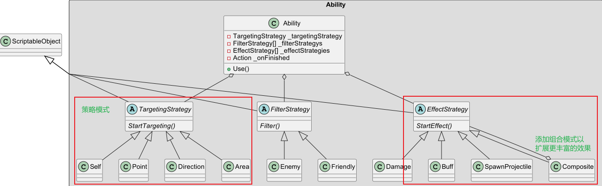
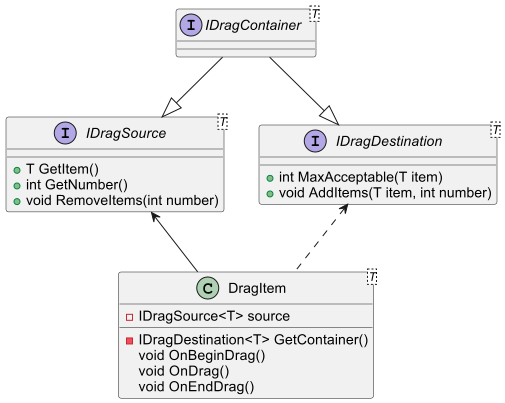
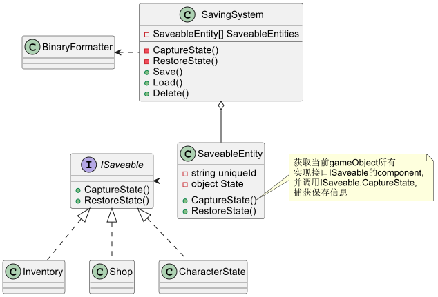

# FirstARPG
## 动作编辑器
RunTime部分代码结构

## 技能系统

将技能的释放流程分为，目标选择、目标筛选和效果。并使用策略模式分别进行多种实现
比如目标选择，可以有选择自己、选择一个方向、一个区域等
目标筛选，可以有筛选敌人、筛选友军

效果方面加入组合模式以扩展更丰富的效果。Composite继承自EffectStrategy，同时又包含了一个EffectStrategy的列表，可以将多个EffectStrategy组合成一个EffectStrategy，从而实现更丰富的效果。

## 其他
### 通用拖拽

定义了拖拽来源类IDragSource，GetItem、GetNumber方法分别从来源获取拖拽的item和其数量。RemoveItems定义了拖拽操作成功后，来源类要做的逻辑（删除item之类的）。
拖拽目标类，MaxAcceptable定义了可容纳的最大数量；Additem定义了拖拽成功后，目标类要做的逻辑（添加item之类的）。
只实现IDragSource则只能拖出，只实现IDragTarget则只能拖入。实现了两个接口则为容器类。

以泛型实现各个类，“T”就为推拽传递的数据类型，可方便的在各个系统分别实现拖拽。  或者给各个“T”定义一个相同的基类，以实现不同系统之间的拖拽。
### 保存
